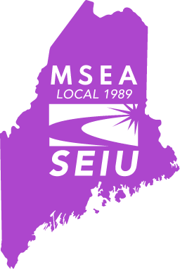
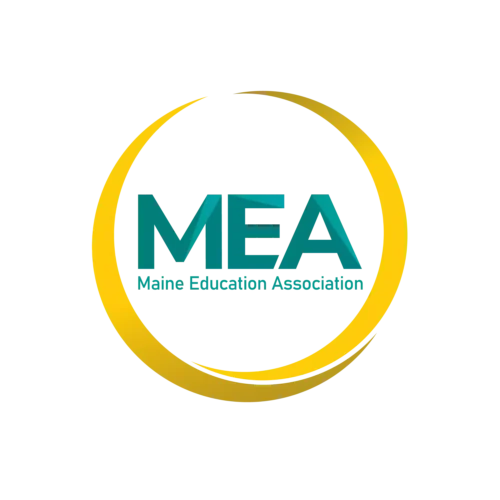
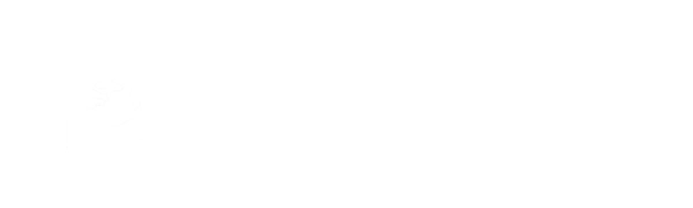
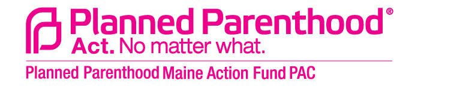

---
html_theme.sidebar_secondary.remove:
---

<!-- CSS overrides on the homepage only -->

<!-- (homepage)= -->

  <!-- Start Hero Left -->
  
  <h3 style="font-weight: bold; margin-top: 10; color:white;">A progressive voice for Portland</h3>
  
I believe there is a place for empathy, compassion, and creativity in our political system, and I would be honored to bring these values to Augusta as your representative.

  <!-- End Hero Left -->

  <!-- Start Hero Right -->

:::{card}
:img-background: _static/hero_portrait.png
:img-alt: Dylan Pugh photo
:margin: auto
:class-card: hero-image
:::

  <!-- End Hero Right -->

  <!-- End Hero -->

<!-- Keep in markdown to generate headerlink -->
# Core Issues
:::::{grid} 1 1 2 2
:gutter: 5

::::{grid-item-card}
:shadow: none
:class-card: sd-border-0

  <h4><strong>Affordable Housing</strong></h4> 

Building more is absolutely essential, but we also need to critically examine the ownership structure of existing housing stock. While the commoditization of housing may be normal, it is neither just, nor inevitable. We must have the courage to explore alternatives and ensure that everyone can live here with dignity.
::::

::::{grid-item-card}
:shadow: none
:class-card: sd-border-0

  <h4><strong>Economic Justice</strong></h4> 

Making Portland affordable isn’t just about lowering costs: we also need to increase wages, job security, and worker power. As a former small business owner, I know the risks and complexities of entrepreneurship well, and I am committed to supporting local businesses. We can meet this challenge and increase the wealth, stability, and diversity of our community.
::::

::::{grid-item-card}
:shadow: none
:class-card: sd-border-0

  <h4><strong>Ending Homelessness</strong></h4> 

We need to put people in homes now and ensure that everyone has a no-barrier pathway to economic security. Activists on the front lines of this effort have shown us the way forward: the Housing First approach. We have the power, and the responsibility, to make homelessness a thing of the past in Portland.
::::

::::{grid-item-card}
:shadow: none
:class-card: sd-border-0

  <h4><strong>Climate Resilience</strong></h4> 

The Gulf of Maine is warming more quickly than 99% of the world's oceans. Climate change poses an existential threat to coastal communities, and will drastically reshape our state if we do not act now. We must support a transition to clean energy, investments in resilience, and critical supports for the working waterfront.
::::

:::::

# Endorsements

I am honored to have the support of these grass-roots organizations.

::::{grid} 1 3 3 3

:::{grid-item}
<!-- :class: endorsement-grid -->

:::

:::{grid-item}
<!-- :class: endorsement-grid -->

:::

:::{grid-item}
<!-- :class: endorsement-grid -->

:::

:::{grid-item}
:columns: 6
:margin: 4 auto auto auto
:class: sd-border-0
<!-- :class: endorsement-grid -->

:::

:::{grid-item}
:columns: 6
:margin: 5 auto auto auto
:class: sd-border-0
<!-- :class: endorsement-grid -->

:::

::::

:::{toctree}
:maxdepth: 1
:hidden:

Issues<issues>
Updates<blog>
:::
